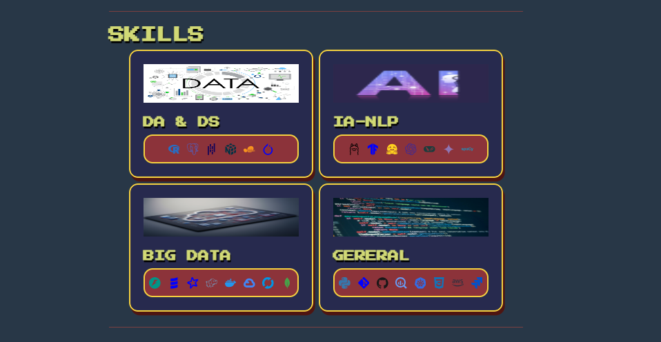

# PORTFOLIO-WEB PABLO DE ALVA

## Descripción proyecto:
Portfolio web Desarrollado utilizando [Python](https://python.org) y [Reflex](https://reflex.dev) para mostrar mis proyectos, formación y experiencia laboral.

## Tecnologías utilizadas:

## Demo portfolio:

### Para más información visitame en:
* [Linkeding](https://www.linkedin.com/in/papuuu21/) 
* [Portfolio](https://portfolio-gray-wood.reflex.run/)
* [GitHub](https://github.com/Papuuu21)